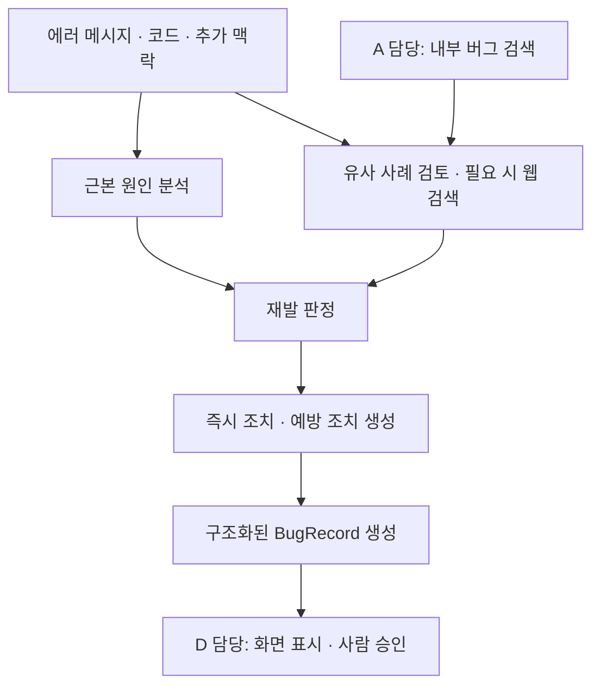
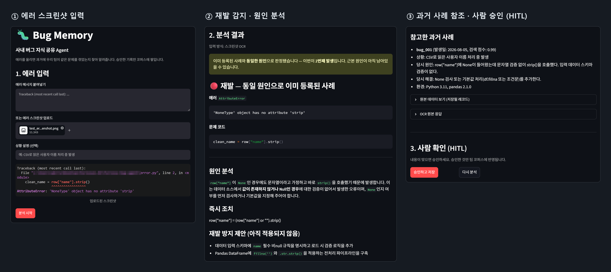
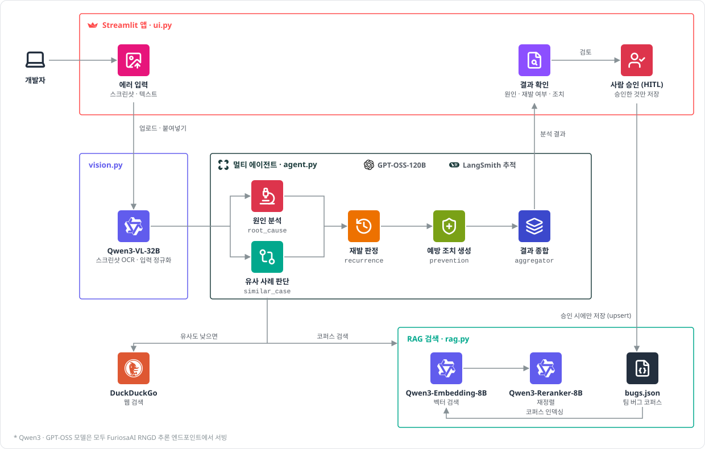

<div align="center">

# 🐛 Bug Memory

**FuriosaAI RNGD 기반 사내 버그 지식 공유 Agent**


**담당 — Multi-Agent 분석**

</div>

에러 스크린샷이나 텍스트를 입력하면 과거 버그 사례를 찾아 **원인·해결 방법·재발 방지 조치**를 정리하는 에이전트입니다. 사람이 승인한 결과를 팀의 버그 기록으로 저장해, 같은 문제를 다시 만났을 때 참고할 수 있도록 만들었습니다.

숭실대학교 FuriosaAI RNGD 단기강좌의 **4인 팀 미니 프로젝트**이며, 저는 **LangGraph 기반 분석 모듈(C)**을 담당했습니다. 이 저장소는 [팀 프로젝트](https://github.com/sojjeoi/furiosa-bug-agent)를 바탕으로 제 기여를 정리한 개인 저장소입니다.

## 맡은 부분

핵심 구현 파일은 [app/agent.py](app/agent.py)입니다. 입력된 에러가 원인 분석부터 해결책 정리까지 이어지도록 분석 흐름과 노드 간 상태를 구현했습니다.

| 구현 내용 | 담당한 작업 |
|---|---|
| **분석 흐름 구성** | `AnalysisState`와 5개 노드를 정의하고, 원인 분석·유사 사례 검토를 병렬로 시작한 뒤 재발 판정 → 예방 조치 → 결과 종합으로 연결 |
| **근본 원인 분석** | GPT-OSS-120B에 에러 메시지·코드·추가 맥락을 전달해 원인을 설명하는 `root_cause_node` 구현 |
| **유사 사례 검토와 웹 검색** | A 담당의 검색 함수와 연동하고, LLM의 Tool Calling으로 DuckDuckGo 검색 실행 및 검색 결과를 다시 LLM에 전달하는 흐름 구현 |
| **재발 판정** | 검색 점수와 원인 비교를 이용해 `confirmed / possible / new`로 구분하는 초기 `recurrence_node` 구현 |
| **해결책과 결과 생성** | 즉시 조치·예방 조치·태그를 JSON으로 받고, 저장용 `BugRecord`와 초기 화면용 Markdown 생성 로직 구현 |

## C 파트 분석 흐름



웹 검색은 `tool_choice="auto"`로 LLM이 호출 여부를 결정합니다. 내부 후보가 없거나 검색 점수가 낮으면 검색하도록 프롬프트로 안내하고, 검색 결과를 `tool` 메시지로 다시 전달해 후속 분석에 활용합니다. 검색한 출처의 URL과 확인 시각도 결과에 남깁니다.

분석 모듈은 기록을 직접 저장하지 않습니다. D 담당 화면에서 사용자가 승인한 뒤 A 담당의 저장 함수를 호출하도록 역할을 나눴습니다.

### 초기 구현과 현재 버전의 차이

- **재발 판정:** 초기에는 검색 점수와 원인 비교로 3단계 판정을 구현했습니다. 현재 팀 통합 버전은 데모 안정성을 위해, 후보 검토 후 남은 후보가 있으면 `confirmed`, 없으면 `new`로 단순화했습니다. 현재 판정 노드가 점수 임계값이나 원인 일치를 직접 검사하는 것은 아닙니다.
- **화면 표시:** 초기 C 구현은 저장용 데이터와 화면용 Markdown을 각각 만들었습니다. 현재는 C가 `record`를 생성하고 D의 `ui.py`가 화면을 렌더링합니다.

## 구현하면서 다룬 문제

| 문제 | 대응 |
|---|---|
| **도구 호출을 강제했을 때 빈 응답 발생** | 당시 강좌 엔드포인트에서 `tool_choice="required"`나 특정 함수 강제 지정이 정상 동작하지 않아, `auto`와 명시적인 검색 조건을 사용 |
| **추론 토큰 때문에 응답이 잘리는 현상** | GPT-OSS-120B 호출 목적에 따라 응답 토큰 한도를 조정. 초기 원인 비교는 200, 원인 분석·예방 조치 생성은 800으로 설정 |
| **노드 결과를 다른 모듈에 전달하는 방식** | 원인·후보·외부 근거·판정·예방 조치를 `AnalysisState`로 나누고, 마지막에 저장용 구조로 종합 |

위 내용은 당시 구현·확인한 범위입니다. 도구 호출 성공률이나 재발 판정 정확도를 별도 벤치마크로 검증한 것은 아닙니다.

## 실행 화면

팀 통합 버전의 실제 실행 화면입니다. 에러 입력부터 분석 결과, 과거 사례 확인, 사람 승인까지 이어집니다.

<p align="center">
  
</p>

## 팀 역할

| 담당 | 역할 | 주요 파일 |
|---|---|---|
| A | 버그 코퍼스 검색·저장, 임베딩·리랭킹 | [rag.py](app/rag.py) |
| B | 스크린샷 OCR, 텍스트·이미지 입력 정리 | [vision.py](app/vision.py) |
| **C** | **LangGraph 분석 노드, Tool Calling, 재발 판정, 해결책 생성** | [agent.py](app/agent.py) |
| D | Streamlit UI, 사람 승인, LangSmith 추적 | [ui.py](app/ui.py) |

C 파트에서는 **Python · LangGraph · OpenAI SDK · GPT-OSS-120B · DuckDuckGo(ddgs)**를 사용했습니다. 
팀 전체 시스템에는 Qwen3-VL, Qwen3-Embedding, Qwen3-Reranker, Streamlit, LangSmith를 함께 사용했습니다.

<details>
<summary>전체 시스템 아키텍처 보기</summary>



</details>

## 설치 및 실행

> 실행하려면 사용 가능한 API 키와 엔드포인트가 필요합니다. 다른 서비스를 연결할 경우 코드의 엔드포인트·모델 설정도 맞춰야 합니다.

```bash
git clone https://github.com/7b7hom/furiosa-bug-agent.git
cd furiosa-bug-agent
python -m pip install -r requirements.txt
```

프로젝트 루트에 `.env`를 만들고 모델별 키를 설정합니다.

```dotenv
FURIOSA_VL_API_KEY=your_vision_api_key
FURIOSA_LLM_API_KEY=your_llm_api_key
FURIOSA_EMBEDDING_API_KEY=your_embedding_api_key
FURIOSA_RERANKER_API_KEY=your_reranker_api_key

# 선택: 실행 추적
LANGSMITH_API_KEY=your_langsmith_api_key
```

```bash
python -m streamlit run app/ui.py
```

에러 텍스트나 스크린샷을 입력하고 **분석 시작 → 결과 확인 → 승인하고 저장** 순서로 사용합니다.

## 한계와 개선 방향

현재 재발 판정은 데모용으로 단순화되어 있어, 같은 메시지라도 원인이 다른 사례를 구분하는 검증이 더 필요합니다. 예방 조치는 제안만 하며, 실제 코드 수정과 테스트는 사용자가 수행합니다. 검색 결과의 신뢰도 검증과 민감정보 자동 마스킹도 후속 과제입니다.

[팀 원본 저장소](https://github.com/sojjeoi/furiosa-bug-agent) · [현재 분석 코드](app/agent.py) · [C 파트 초기 설계 메모](docs/AGENT.md)
